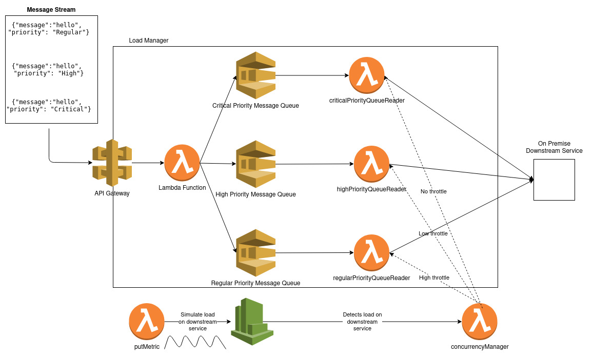

Built a POC for an API Load Manager using Serverless. Messages sent to the API may have critical, high or regular priority. Depending on the load on the back-end server inbound messages are throttled using different criteria. Critical messages are never throttled and regular messages are throttled more than high priority messages. Thus, the Load Manager throttles messages depending on the load on the back-end system. As part of the POC load on the backend system was simulated in a continuous cyclical fashion.

Inbound messages are received by an API Gateway endpoint connected to a lambda called receiveRequests. Messages sent to this endpoint contain the following contents:

{"message":"hello faraz!", "priority": "Critical"}

The value of the key, priority, can be: Critical, High or Regular, indicating the priority of the inbound message. Based on the value of the priority, lambda forwards the message to one of 3 queues: the critical priority message queue, high priority message queue or the regular priority message queue.

Each of these queues in turn is connected to a lambda, called criticalPriorityQueueReader, highPriorityQueueReader and regularPriorityQueueReader respectively to read messages from the associated queue and forward it to a downstream consumer.

In another part of the application a lambda, called putMetric, triggered every 12 minutes by CloudWatch generates a value for a custom CloudWatch metric that represents a simulated value of the load of the downstream consumer. This load varies in an arbitrary range of 0 to 650.

A lambda, called concurrencyManager, reads the value of this custom CloudWatch metric and throttles each of the lambdas associated with the three queues. The criticalPriorityQueueReader is not throttled, whereas the highPriorityQueueReader is throttled less than the regularPriorityQueueReader.

